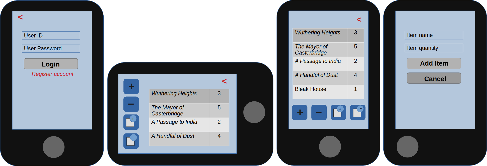
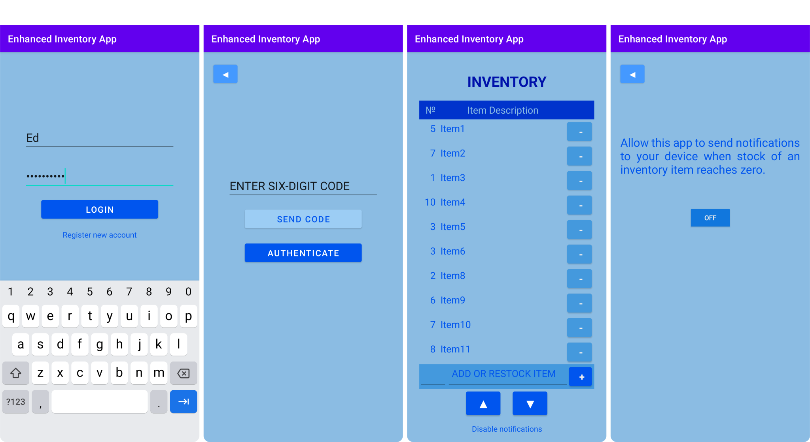


# Ed Morrow's Computer Science Portfolio

## Professional Self-Assessment

I have been studying for a B.S. in Computer Science with a concentration in Software Engineering since July 2019. During that time, I have been exposed to several topics in computer science which I had had very little knowledge of previously. Most notable among those would be the fields of database management and data analytics: in particular, the *CS-340: Client/Server Development* course, which introduced me to non-relational databases (the document database MongoDB, in this case) was especially interesting, as was the *CS-350: Emerging Systems Architecture and Technology* class. *CS-405: Secure Coding* and *CS-410: Software Reverse Engineering* also provided a structured overview of subjects that I had some familiarity with but had not studied rigorously.

Besides exposing me to topics which previously I had only a fragmentary knowledge of, topics which I had put off in favor of other, more immediately accessible or engaging subjects, or topcis that I had simply never heard of, it also developed my confidence by requiring me quickly to get up to speed with new topics and new projects each term and work to deliver assignments according to the deadlines prescribed by the course. While I have also learned a great deal through self-study, both prior to and during working on this degree, working according to one’s own schedule does not always bestow the same feeling of confidenece in a subject that working according to formal requirements and timelines can.

During this capstone class (*CS-499: Computer Science Capstone*) I have reviewed the work I submitted throughout my program and selected artefacts to enhance for three categories: 
1. Software Design and Engineering;
2. Algorithms and Data Structures; and
3. Databases. 

The artefacts were selected to address the following course outcomes:

1. Employ strategies for building collaborative environments that enable diverse audiences to support organizational decision making in the field of computer science;
2. Design, develop, and deliver professional-quality oral, written, and visual communications that are coherent, technically sound, and appropriately adapted to specific audiences and contexts;
3. Design and evaluate computing solutions that solve a given problem using algorithmic principles and computer science practices and standards appropriate to its solution, while managing the trade-offs involved in design choices;
4. Demonstrate an ability to use well-founded and innovative techniques, skills, and tools in computing practices for the purpose of implementing computer solutions that deliver value and accomplish industry-specific goals; and
5. Develop a security mindset that anticipates adversarial exploits in software architecture and designs to expose potential vulnerabilities, mitigate design flaws, and ensure privacy and enhanced security of data and resources.

Working on these enhancements was satifying as it allowed me not only to reflect on what I have achieved so far but also to recognize how much more I am able to bring to these projects in light of what I have learned since working on them originally. The opportunity to benefit from feedback from our instructor is also something that I have been grateful for over the duration of this final class.

The work I have completed throughout my program has already touched on many of the course outcomes listed above: *CS-340: Client/Server Development*, whose focus was on creating a MongoDB database client and dashboard, for example, was particularly applicable to outcome one; *CS-405: Secure Coding* naturally dealt with the issues addressed in outcome five, but the course's final project (the creation of a security policy document and delivery of an accompanying presentation) also demonstrated proficiency in the skillset described in outcome two; and several other classes, most recently *CS-410: Software Reverse Engineering*, evinced competence in the areas discussed in outcomes three and four. However, the enhancements made to the three artefacts discussed below provide specific examples of how I met the course outcomes as part of the *CS-499: Computer Science Capstone* class. For each artefact, I have provided a link to a repository containing the code as originally submitted, a narrative discussing the enhancements I made, and a link to another repository containing the enhanced code.

## Code Review
Following is the video code review I created prior to embarking on the proposed enhancements to my code:

  
<br/>

## Category One: Software Design and Engineering
#### Morse Code Signalling Device
<a href="https://github.com/MaYingHu/CS499OriginalEmbeddedSystem/">Original Code for Morse Code Signalling Program</a>

The artefact I chose to enhance for this category was a program to drive a Texas Instruments developer board (the <a href="https://www.ti.com/product/CC3220S?utm_source=google&utm_medium=cpc&utm_campaign=epd-con-null-prodfolderdynamic-cpc-pf-google-wwe_int&utm_content=prodfolddynamic&ds_k=DYNAMIC+SEARCH+ADS&DCM=yes&gclid=CjwKCAjwyqWkBhBMEiwAp2yUFiHRiiUVbY2-NhIi8TBkDs9W6MIYJajMIaiPet_6u3Or9EIftjTzCBoCpBEQAvD_BwE&gclsrc=aw.ds">*TI CS3220S*</a>) to signal one of two Morse code messages on its LEDs and to switch between them (after completing the message in progress) at the press of a button. I created this as the third and final milestone of my *CS-350: Emerging Systems and Architectures* class.

I chose this artefact because it showcases the skills I acquired writing code for embedded systems, a field of which I had next to no practical experience prior to starting the class.

As part of my *CS-499: Computer Science Capstone* class, I performed the following enhancements:

1. I simplified the functions employed to drive the LEDs from one for each of the possible permutations (four in all, in the case of two LEDs) to one total, taking a bit-field as function argument (with each bit corresponding to the state of a particular LED): this not only streamlined the existing code but would also make it much simpler to extend if a singaling mechanism with more than two elements were to be employed in the future;
2. I decomposed the signaling function into its most fundamental elements. In my initial submission, I had hardcoded each message as a switch statement examining every possible $500ms$ phase in the message's lifetime, an approach which was both tedious and error-prone. For the enhancement, only the individual Morse symbols (*i.e.*, the dot, the dash and the pause) were taken phase-by-phase: the message as a whole was iterated over character-by-character, each character in turn was transcribed into its Morse equivalent, and then that Morse code was iterated over with each symbol being signalled phase-by-phase;
3. I created a function containing a switch statement to transcribe characters into their Morse equivalent in order to facilitate the above enhancement. Not all characters have a Morse equivalent, so I made the decision to replace all such characters with a space;
4. I stored the available messages in an array, and separated the button functions to cycle forwards or backwards through that array; previously, both buttons performed the same function of switching from one message to the other. The user need only add or remove strings from the array to change the selection of messages available.

While my initial attempt ran correctly, the enhancements have made the code more reusable and extendable as it is now straightforward to add an arbitrary number of messages which will be signaled in the same way, and the list can be navigated either forwards or backwards depending upon which button is pressed. This shows an ability to look beyond the most basic requirements to create a better-organized and more flexible system which not only meets the initial specifications but provides a basis for further development of the code.

This enhanced artefact demonstrates my ability to design and evaluate computing solutions that solve a given problem using algorithmic principles and computer science practices and standards appropriate to its solution while managing the trade-offs involved in design choices (*i.e.*, course outcome three), because I developed it beyond the most obvious approach — at least, that which was most obvious to me — to achieve the most basic functionality required and instead abstracted the logic to the point where it can signal any message that is passed to it: all that would be required would be to add or remove strings from the array of messages, and those would then be available to signal as Morse code, too. The heart of the code — which takes a message charcter-by-character, converts each character to its Morse code equivalent and then iterates over that Morse code symbol-by-symbol (symbols being dots, dashes or the pauses between them), signalling each symbol by $500ms$ phases ($500ms$ being the greatest common denominator between all symbols and pauses) — is reproduced below in pseudocode:

###### Pseudoode for the signal_message() function:
```
INPUT string message;
INPUT int phase;

DEFINE character char;
DEFINE string morse;
DEFINE character symbol;
DEFINE boolean message_ended;

// initially assume message is still in progress
ASSIGN message_ended ← false;

// take message one character at a time until the end
ASSIGN char ← next_character(message);
WHILE char IS NOT end_of_string:

  // transcribe character into Morse symbols 
  ASSIGN morse ← convert_to_morse(char);

  // take Morse code one symbol at a time
  ASSIGN symbol ← next_symbol(morse);
  WHILE symbol IS NOT end_of_string:

    // determine the nature of the current symbol
    IF symbol IS ".":

      // get next symbol if current one is complete
      IF phase > length(dot_signal):
        ASSIGN symbol <- get_next_symbol(char);
        ASSIGN phase ← 0;
      // and signal next phase of current symbol if not
      ELSE:
        CALL signal_dot(phase);
        INCREMENT phase;

    ELSE IF symbol IS "-":

      // get next symbol if current one is complete
      IF phase > length(dash_signal):
        ASSIGN symbol ← get_next_symbol(char);
        ASSIGN phase ← 0;
      // and signal next phase of current symbol if not
      ELSE:
        CALL signal_dash(phase);
        INCREMENT phase;

    // get next symbol if current one is complete
    IF phase > length(space_pause):
      ASSIGN symbol ← get_next_symbol(char);
      ASSIGN phase ← 0;
    // and signal next phase of current symbol if not
    ELSE:
      CALL signal_space(phase);
      INCREMENT phase;

  // get the next character if the preceeding is finished
  CALL signal_intra-character_pause();
  ASSIGN character ← next_character(message);
  ASSIGN phase = 0;

// end of message reached
CALL signal_intra-message_pause();
ASSIGN phase ← 0;
ASSIGN message_ended ← true;

// cycle message if button pressed
IF left_button_pressed:
  ASSIGN message ← get_previous_message()
IF right_button_pressed:
  ASSIGN message ← get_next_message()
```

The enhanced code also demonstrates an ability to design, develop, and deliver professional-quality oral, written, and visual communications that are coherent, technically sound, and appropriately adapted to specific audiences and contexts, and also to employ strategies for building collaborative environments that enable diverse audiences to support organizational decision making in the field of computer science (course outcomes one and two): the documentation for this project included — besides the pseudocode shown above — a flow-chart that would allow stakeholders to understand the workings of the program without having to understand the code itself:

###### Flowchart for the enhanced Morse Code Program:


Communications of this sort are invaluable when seeking to elicit a broader range of opinions and more diverse input on a project, because it conveys the essential workings of the program without belaboring the audience with an excessive amount of technical detail: while the code is sufficiently well documented to speak for itself to those who understand its language, relying on the code alone would exclude potential collaborators who may not be so well versed in the finer points of embeded systems programming but have other knowledge and insights that could benefit the project. The documentation for this artefact demonstrates my ability to communicate and collaborate with programmers and non-programmers alike.

In creating and then enhancing this artefact, I was reminded again of the importance of distilling code down to the most fundamental level appropriate for the task to allow different parts of the code to be reused wherever possible: in this case I reduced four separate functions for controlling the LEDs to just one which would set them to any possible permutation based on an integer parameter which would serve as a bit-field (with each LED corresponding to a binary place in the integer, being switched on or off depending on whether that bit was one or zero). I also learned how disassembling the task to more fundamental components (in this case, iterating over the message character-by-character, then over each character’s Morse code representation symbol-by-symbol, and finally over each symbol phase-by-phase) was a little more work than my initial approach (directly hard-coding each message) but paid dividends when it came to changing or adding new messages, which is trivial in the enhanced version but would require the rather laborious creation of new switch statements for each phase of each new message. While over-abstracting can potentially lead down a rabbit-hole and away from the prospect of actually completing and delivering compelte and useful code, there is a happy medium where foresight can prompt us to invest some extra work in the early stages of development to greatly simplify changes further down the road, and I the enhancements I made to this code represent a good example of that.

<a href="https://github.com/MaYingHu/CS499EnhancedEmbeddedSystem/">Enhanced Code for Morse Code Signalling Program</a>

## Category Two: Data Structures and Algorithms 
#### Linked List

<a href="https://github.com/MaYingHu/CS499OriginalLinkedList">Original Code for Linked List</a>

The artefact I chose for this category was code for a linked list which was written in C++. I created this as a milestone in the *CS-260: Data Structures and Algorithms* class. The linked list contained an umber of *bids*, that is, a struct containing several data items, the most notable being an ID number. THe linked list class included methods to prepend and postpend elements, to search for or delete and element by ID number, and to print the list.

I included this artefact in my portfolio because it demonstrates proficiency in working with data structures and manipulating them using appropriate algorithms. 

For the enhancement, I implemented several additional methods that were not included originally:.

1. a method to insert an item into the list at a given index;
2. a method to clear the list and leave it empty;
3. a method to delete the list entirely;
4. a method to delete an item at a given index; to
5. methods to find an item and return its index and to get an item at a particular index;
7. methods to reverse the list in-place or to return a new list which is a reversal of the original;
8. a method to convert the list to a C++ vector;
9. and a method to sort the list in-place.

I removed the code from its original context (which included a CSV file and a parser which were provided to me for the project) because the purpose of the enhancements was to make the code more reusable.

For the last method mentioned, I opted for a merge sort as its worst-case runtime is $\mathcal{O}\(n\log n\)$, as it is not subject to pathological cases of the sort that reduce quicksort to $\mathcal{O}\(n^2\)$ time; and the sequential-access nature of linked lists means it is better suited to those applications than quicksort anyway. The enhancements resulted in code which is more modular and reusable and has removed the possibility of memory leaks which had not been addressed in the original.

The enhanced code demonstrates my ability to design and evaluate computing solutions that solve a given problem using algorithmic principles and computer science practices and standards appropriate to its solution while managing the trade-offs involved in design choices (outcome three) because it shows evidence of thinking in terms of algorithmic efficiency when working on the enhancements: for example, I opted for a selection sort as the most suitable sorting algorithm for the resaons discussed above; and for the method to reverse the list in-place, I was able to craft a solution in $\mathcal{O}\(n\)$ time by making a single pass through the list and reversing the direction of the links, rather than adopting much more time-consuming process that would have involved first navigating to the end of the list (*i.e.*, sequentially accessing each node in turn) before moving backward through the list again to redirect them.

These enhancements also show that I can use well-founded and innovative techniques, skills, and tools in computing practices for the purpose of implementing computer solutions that deliver value and accomplish industry-specific goals (outcome four) because, in addition to considering the proper implementation of algorithms for each method, I also explored how the code could be reused across multiple applications, and thus ensured that it be modularized as much as possible to facilitate that end.

<a href="https://github.com/MaYingHu/CS499EnhancedLinkedList">Enhanced Code for Linked List</a>

## Category Three: Databases
#### Inventory Management App for Android

<a href="https://github.com/MaYingHu/CS499OriginalAndroidApp">Original Code for Android Inventory App</a>

The artefact I chose for this category was an Android inventory management app which I developed as my final project in *CS-360: Mobile Architecture and Programming*.

I chose this artefact for my portfolio because it offers an example of an Android app which I developed to meet a prospective client's requirements. Mobile app development is a field that I hope to move into after graduating, so it seemed a natural choice for my personal portfolio. The artefact as a whole demonstrates my ability to code apps in Android studio, to work to create a design around an existing specification and to incorporate the use of a SQLite database into the app to hold both user data and the inventory data itself. Following are mockups of the original app at the initial design stage:

###### Mockups showing Login Screen, Inventory Screen (landscape and portrait) and Add Item Screen:



I made the following enhancements to the app:

1. I added two-factor authentication to the login process (requiring that the user input a six-digit one-time passcode texted to their ’phone following authentication of their username and password in order to be authenticated);
2. I created a new *AuthenticateLogin* activity to support the above;
3. I added columns to the user data table of the database to include the salt for each user, the randomly-generated passcode and a timestamp for that passcode, as it would expire after three minutes;
4. I incorporated salted and hashed passwords to protect user data even in the evenet of a data breach.

The documentation for the original and the enhanced code evinces an ability to design, develop, and deliver professional-quality oral, written, and visual communications that are coherent, technically sound, and appropriately adapted to specific audiences and contexts, and also to employ strategies for building collaborative environments that enable diverse audiences to support organizational decision making in the field of computer science (course outcomes one and two), because it was necessary to work according to the specified requirements provided by the client, to develop the initial design around those and to seek approvla for the design before moving forwards. Although, in the class, the part of the prospective client was played by my instructor, the communications were tailored to be accessible and meaningful to stakeholders with little to no knowledge of the coding principles behind the app's creation, and were more focused on sharing a vision of what the final app would look like from the user's perspective.

Botth versions also show that I can use well-founded and innovative techniques, skills, and tools in computing practices for the purpose of implementing computer solutions that deliver value and accomplish industry-specific goals (outcome four): the app met all of the requirements outlined in the client's brief, creating value for their organisation; and the enhanced version also offered imrpoved security by utilising industry-standard libraries (*i.e.*, the *MessageDigest* library) and security best-practices (salting and hasing passwords and requiring two-factor authentication) which would help to protect the client from possible attacks while benefiting from the app's functionality. 

The enhancemenst also show that I am able to develop a security mindset that anticipates adversarial exploits in software architecture and designs to expose potential vulnerabilities, mitigate design flaws, and ensure privacy and enhanced security of data and resources (*i.e.*, course outcome five): although the client's requirements made no mention of security (since clients cannot necessarily be expected to be knowledegable about such issues), it is the duty of a computer science professional to ensure that the code they develop is secure and that it does not place client's systems and data at risk. By preempting possible attacks against the app I demonstrated an awareness of such issues and ability to address them proactively.

THe screenshots below are from the emulated version of the final, enhanced app:

###### Screenshots from the Emulator showing Login Screen, Authenticate Login Screen, Inventory Screen and Enable Notifications Screen:



In enhancing this artefact, the main obstacle I had was with reacquainting myself with the original code and then determining which additional methods and (in the case of two-factor authentication) activities I would need to add to the existing code. While that was fairly straightforward to do because I was careful to document the code in the first place, it was time-consuming. The other major challenge lay in incorporating existing Java libraries to perform the tasks I could not do myself: while I was able to write my own method to generate a 32-character alphanumeric salt I thought it unwise to attempt to create hashes of the passwords myself, so I used the *MessageDigest* library instead. My main takeaway from working on this was the importance of integrating security thinking into coding from the very beginning, because I could have saved time overall if the initial design had incorporated the two-factor authentication and salting and hashing, whereas integrating them into an existing app took slightly longer. 

<a href="https://github.com/MaYingHu/CS499EnhancedAndroidApp">Enhanced Code for Android Inventory App</a>
